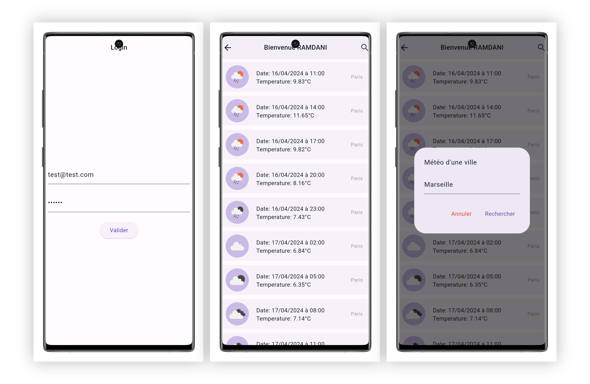

## Weather app
Application permettant d'afficher la météo d'une ville pour les 5 prochains jours.

### Capture d'écran

### Développé par

**Massinissa RAMDANI**

### Packages utilisés

**Packages principaux :**

- **get** : Le package GetX pour la gestion de l'état, de la navigation et de l'injection de dépendances dans les applications Flutter.

- **intl** : Le package intl est utilisé pour la localisation et la gestion des formats de date, d'heure et de nombres dans les applications Flutter.

- **google_fonts** : Ce package permet d'utiliser facilement les polices Google Fonts dans les applications Flutter.

- **flutter_launcher_icons** : Le package flutter_launcher_icons est utilisé pour générer et configurer facilement les icônes de l'application pour les différentes plateformes (Android et iOS).

### Demo
``Email: test@test.com ``
``Password: 123456``
### Bonus
- Ajout d'une fonctionnalité de recherche de la météo d'une ville.
- Prise en charge des modes portrait et paysage.
- Personnalisation de l'icône de l'application.

### Notes
- **Signature de l'application non gérée** : L'application ne comporte pas de signature personnalisée ou de crédits d'auteur.
- **ApiKey**: Dans le test, la clé API est incluse directement dans le code. Pour la production, l'utilisation de variables d'environnement est recommandée pour une gestion sécurisée des clés API.